# Procesverslag
Markdown is een simpele manier om HTML te schrijven.  
Markdown cheat cheet: [Hulp bij het schrijven van Markdown](https://github.com/adam-p/markdown-here/wiki/Markdown-Cheatsheet).

Nb. De standaardstructuur en de spartaanse opmaak van de README.md zijn helemaal prima. Het gaat om de inhoud van je procesverslag. Besteedt de tijd voor pracht en praal aan je website.

Nb. Door *open* toe te voegen aan een *details* element kun je deze standaard open zetten. Fijn om dat steeds voor de relevante stuk(ken) te doen.

## Jij

  
uitwerken voor kick-off werkgroep

  ### Auteur:
  Destiny Mandemaker

  #### Je startniveau:
  Blauw 
  #### Je focus:
  Surface plane
 

## Je website

  
uitwerken voor kick-off werkgroep

  ### Je opdracht:
  https://www.mcdonalds.com/nl/nl-nl.html

  #### Screenshot(s) van de eerste pagina (small screen): 
  home-pagina   
  
  #### Screenshot(s) van de tweede pagina (small screen):
  McDonald's Nieuwsbrief
  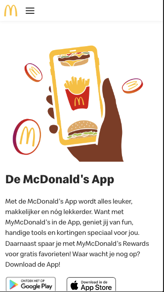
 

## Toegankelijkheidstest 1/2 (week 1)

  
uitwerken na test in 2e werkgroep

  Spelen met screenreader:
  Het was enorm ingewikkeld om te leren werken met screenreaders, na even te hebben geoefend kwam ik tot de conclusie dat mijn website erg goed in gebruik was met een screenreader. Alles was duidelijk aangegeven en BIJNA alle plaatjes (dus niet in de list items) hadden alternatieve tekst waardoor je echt wist hoe de website er beetje uit zag. Echter mochten deze teksten wel wat duidelijk zodat je echt een beeld zou kunnen vormen bij de foto. Verder kon je makkelijk navigeren door de gehele website doormiddel van skiplinks en het duidelijk aangeven waar je op dit dat moment je bevond.

  ### Bevindingen
  Lijst met je bevindingen die in de test naar voren kwamen:
  <li> De website was makkelijk te bedienen na een beetje oefenen. </li>
  <li> Goede duidelijke beschrijvingen </li>
  <li> Goed aangegeven buttons </li>
  <li> Er werd duidelijk aangegeven wat een link was en wat een foto was etc. </li>
  <li> Over het algemeen een "simpele" website met niet veel dingen die missen, goed compleet dus (bijna) </li>

  WCAG checklist:
  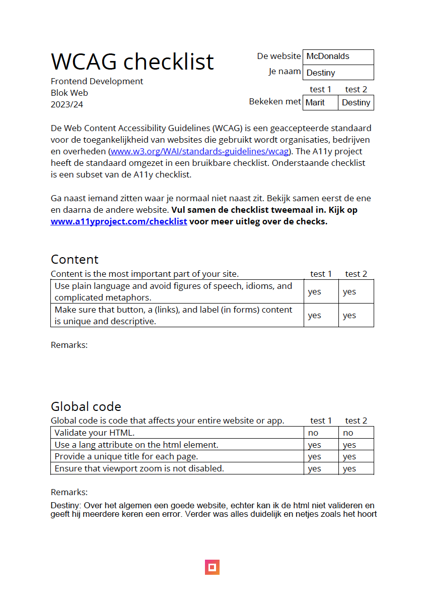
  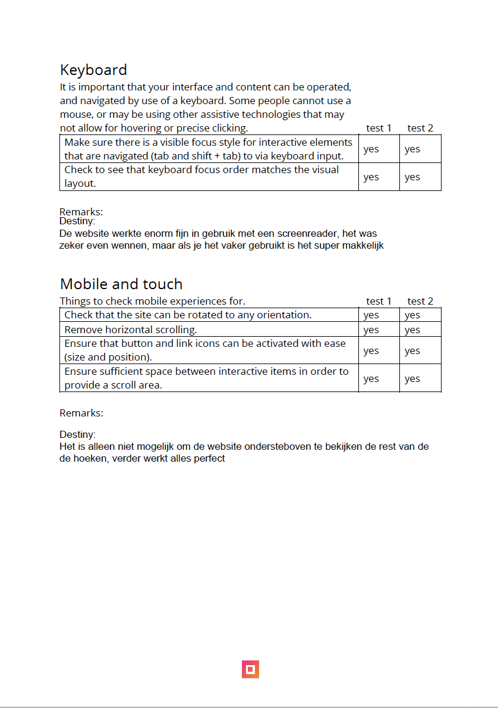
  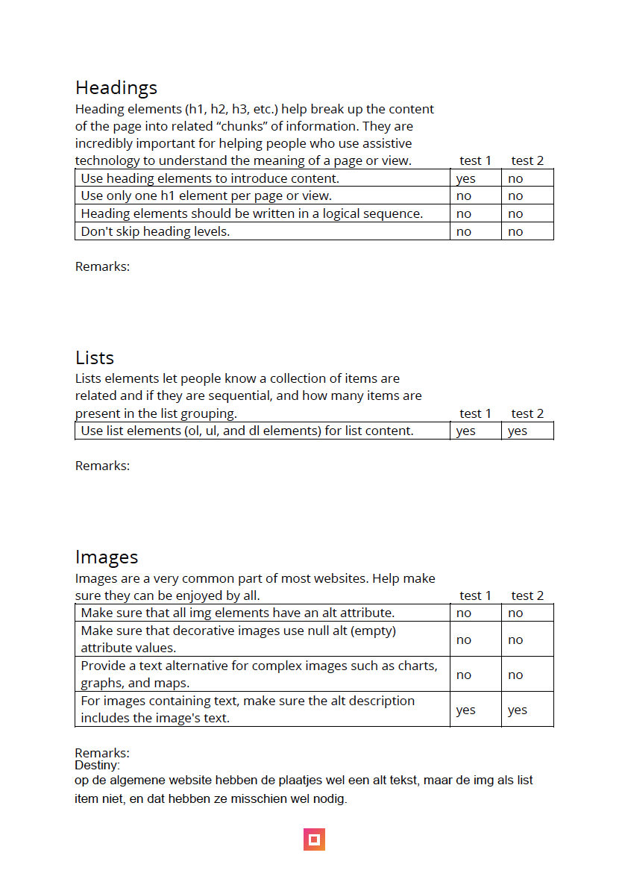
  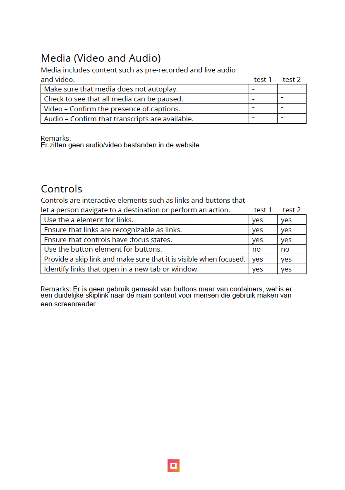
  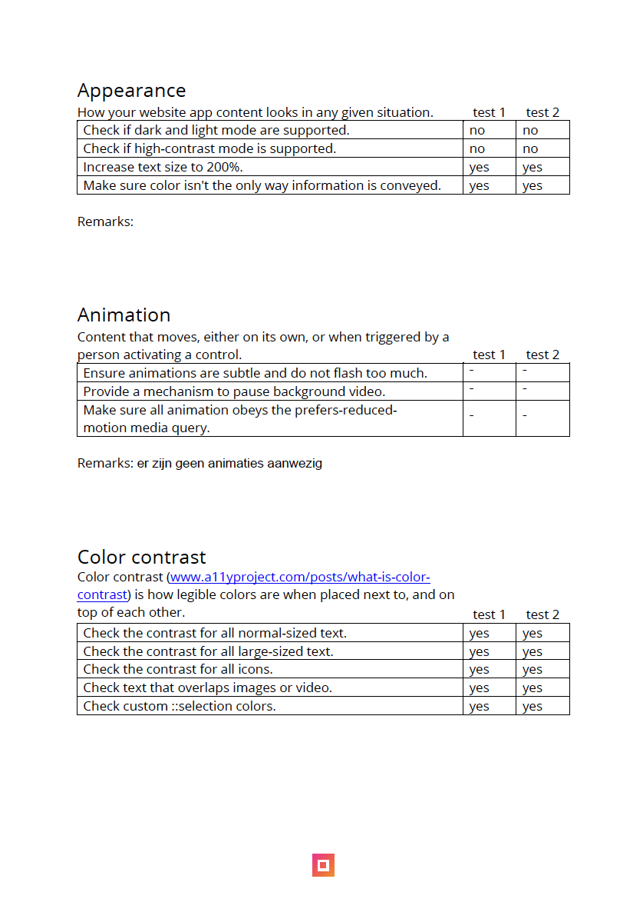

## Breakdownschets (week 1)

  
uitwerken na afloop 3e werkgroep

  ### de hele pagina: 
  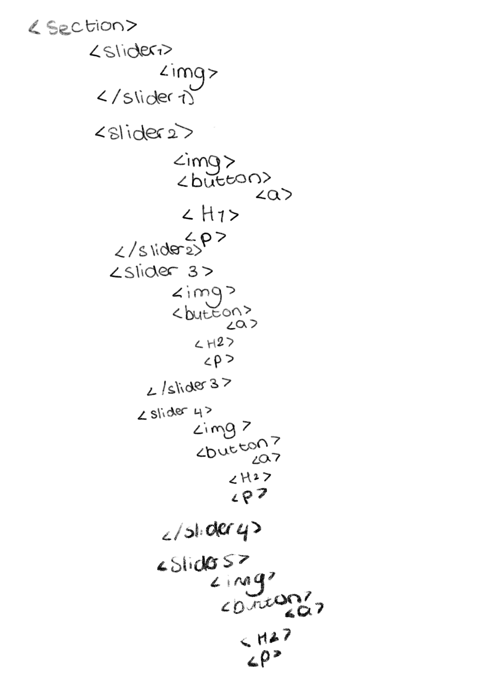
  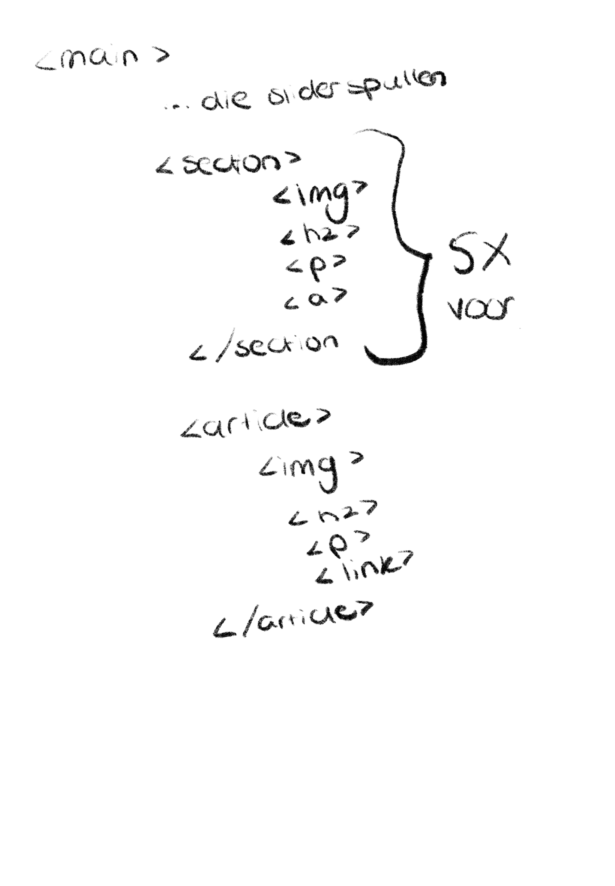
  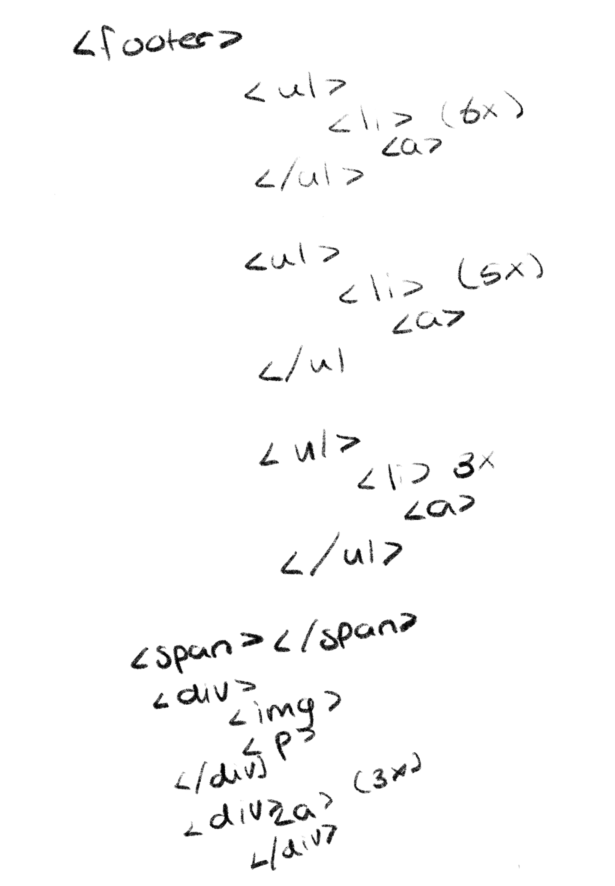

  ### dynamisch deel (bijv menu): 
  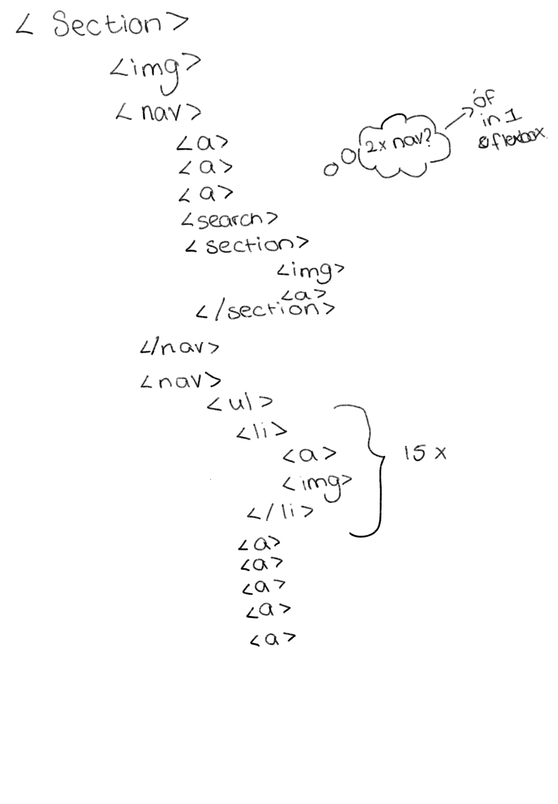

## Voortgang 1 (week 2)

  
uitwerken voor 1e voortgang

  ### Stand van zaken
  Ik vond het lastig om te beginnen aan de website omdat ik er eigenlijk niet zo goed wist waar ik aan moest beginnen, toen ik uiteindelijk
  was begonnen met het maken van mijn nav-bar kwam ik makkelijk in de stemming en ben ik direct van start gegaan, het lukte mij dan ook vrij snel om de nav-bar responsive te maken! Hierbij heb ik een video gekeken op youtube die mij volledig uitlegde hoe en wat ik moest doen, zie bron hieronder.

<a href= "https://www.youtube.com/watch?v=flItyHiDm7E"> link naar video die ik heb gebruikt als referentie </a>

  ### Agenda voor meeting
  samen met je groepje opstellen

  | student 1      | student 2          | student 3    | student 4        |
  | ---            | ---                | ---          | ---              |
  | dit bespreken  | en dit             | en ik dit    | en dan ik dat    |
  | en dat ook nog | dit als er tijd is | nog een punt | dit wil ik zeker |
  | ...            | ...                | ...          | ...              |

  ### Verslag van meeting
  hier na afloop snel de uitkomsten van de meeting vastleggen

  - punt 1
  - punt 2
  - nog een punt
  - ...

  we hebben hier geen gebruik van gemaakt.

## Voortgang 2 (week 3)

  
uitwerken voor 2e voortgang

  ### Stand van zaken
  Na veel gedoe heb ik er voor gekozen om verder te gaan met de rest van de pagina, ik wilde eigenlijk dirct beginnen aan de slider, maar dit lukte mij totaal niet. Na lang ploeteren ben ik uiteindelijk over gegaan op het maken van de rest en later nog eens te kijken naar de slider. Toen ik het voor elkaar had gekregen om de website er goed uit te laten zien op een klein scherm vond ik dat het dan toch tijd was om de slider toe te voegen, ik heb veel opgezocht en veel uit geprobeerd zoals:
  
   <!-- 
		<section class="slider-container">
			

				
Slide 1

				
Slide 2

				
Slide 3

				
Slide 4

			

			

				<button class="prev">Previous</button>
				<button class="next">Next</button>
			

			

				
				
				
				
			

		</section> -->  
    Dit kwam vanaf het internet en heb hier geprobeerd mijn eigen draai aan te geven, maar wat ik ook probeerde het bleef een verkeerde slider. Na een tijdje wilde ik opgeven en gewoon een img plaatsen uit pure frustratie, en toen kreeg ik hulp van de docent, die mij de website liet zien van CSS-tricks, (https://css-tricks.com/css-only-carousel/) hieruit ben ik zelf verder gaan werken en is het mij gelukt om een mooie slider te creeeren. Helaas lijkt hij niet exact op het origineel maar hij komt aardig in de buurt al zeg ik het zelf.

  

  

  Verder heb ik nog in de footer een dropdownlist gemaakt, deze was ook aardig wat gestuntel. De dropdown was of steeds lelijk of niet mooi, maar na het lezen van de volgende pagina (https://www.sliderrevolution.com/resources/css-dropdown-menu/) heb ik meerdere dingen aangepast naar mijn eigen idee en zo kwam de volgende dropdown er uit:

 

 Hier was ik niet volledig tevreden mee, maar nadat ik de tip kreeg om eerst de rest van de app te doen kon ik het er bij laten.
    

 ### Agenda voor meeting
  samen met je groepje opstellen

  | student 1      | student 2          | student 3    | student 4        |
  | ---            | ---                | ---          | ---              |
  | dit bespreken  | en dit             | en ik dit    | en dan ik dat    |
  | en dat ook nog | dit als er tijd is | nog een punt | dit wil ik zeker |
  | ...            | ...                | ...          | ...              |

  ### Verslag van meeting
  hier na afloop snel de uitkomsten van de meeting vastleggen

  - punt 1
  - punt 2
  - nog een punt
- ...

niet gebruikt in de klas.

## Toegankelijkheidstest 2/2 (week 4)

  
uitwerken na test in 9e werkgroep

  ### Bevindingen
De WCAG-checklist heb ik laten uitvoeren door Marit. Uit de test bleek dat ik de knoppen op de website groter moest maken. Dit in verband met het de gebruiksvriendelijkheid van de website voor mensen met een beperking dit heb ik toegepast. Ook gaf Marit aan dat ik voor de gebruiksvriendelijkheid van de website een ‘skip link’ moest toevoegen. Het toevoegen van de ‘skip link’ is helaas niet gelukt. 

Verder vond Marit dat de heading een logische volgorde had, maar miste hierin wel een ‘H1’. Deze heb ik toegevoegd aan de slider. Ook merkte ze op dat er nog geen alternatieve teksten aan mijn afbeeldingen waren toegevoegd. Deze heb ik nu gevuld met een beschrijving van de afbeelding en de tekst die op de afbeeldingen staat.

Tot slot, merkte Marit op dat er geen donkere modus op de website is ingeschakeld. Ik heb dit niet aangepast, omdat ik van mening was dat dit geen prioriteit had en ik mijn tijd beter kon investeren in andere onderdelen.

 WCAG checklist:
  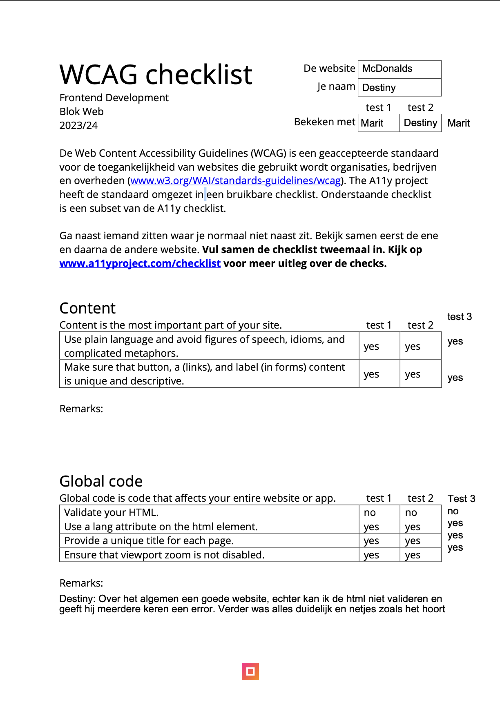
  
  
  
  

## Voortgang 3 (week 4)

  
uitwerken voor 3e voortgang

  ### Stand van zaken
Voor de laatste loodjes was het belangerijk dat ik mijn website zo goed mogelijk responsive maakte en dat ik alle classes en eventuele overbodige PX weg zou halen. Ik begon met het maken van responsive, dit vond ik nogal een hele uitdaging omdat ik het werken met grid een hele opgave vond. Na mij eens goed in te lezen heb ik uiteindelijk mijn website zo goed mogelijk in grids weten te krijgen. 

Toch waren er een aantal onderdelen waarbij ik vast liep zoals het maken van de nav-bar. Doordat de originele website alles in losse classes had staan was het voor mijn idee onmogelijk om de nav bar exact te krijgen als bij het origineel (zie heironder 1e foto origineel en 2e die van mij )
 
 

het enige wat anders was dat ik dus een grid had aangemaakt waardoor alles netjes onder elkaar staat en bij her origneel niet.

Verder was er nog iets waar ik tegen aan liep end dat was het smaller krijgen van het grid. Zie hieronder een afbeelding van mijn website. Ik had namelijk wel voor elkaar gekregen om hem in grid te zetten bij een groot scherm, maar ik kreeg het niet voor elkaar om hem smaller te krijgen en hem aan te laten passen aan de pagina, hierdoor is er ook 1 button die niet helemaal lekker loopt af en toe. 

 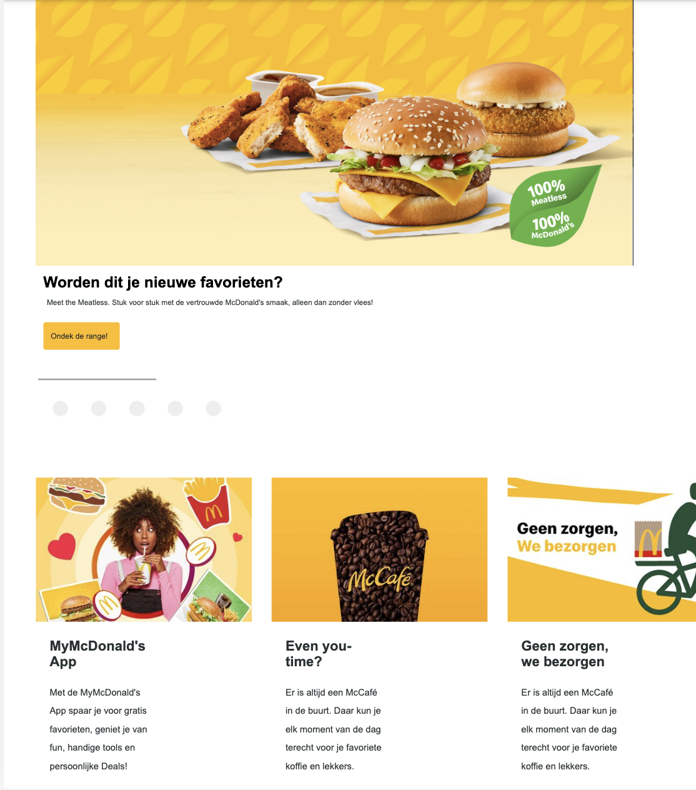
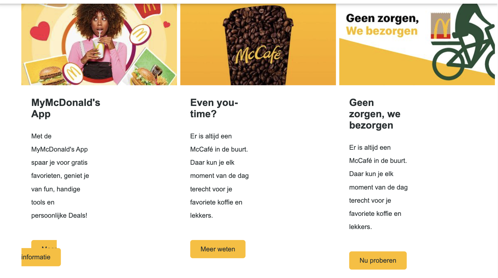

 Echter ben ik heel trots op mezelf dat ik het voor elkaar heb gekregen om de items in een grid te krijgen en die zo te laten zien, ik had nooit verwacht dat dit mij uiteindelijk zou lukken. Ook klopt zo goed als de rest van de website en ben ik zeer tevreden met het eind resultaat en kan niet wachten om het te laten zien bij mijn eind gesprek om mijzelf uit te leggen.

Tot slot heb ik er voor gekozen om de footer van de website te laten voor wat hij was omdat ik me vooral wilde focussen op de rest van de website en niet te lang wilde blijven hangen in de footer. Dit is de reden waarom er met groot scherm dan ook nog steeds ene dropdown zit ipv fysieke lijstjes. Ondanks dat het een actie was uit onmacht vind ik dat het de website siert en dat het niet nodig is om al deze informatie volledig te laten zien bij groot  scherm en daarom heb ik het ook zo gelaten.

 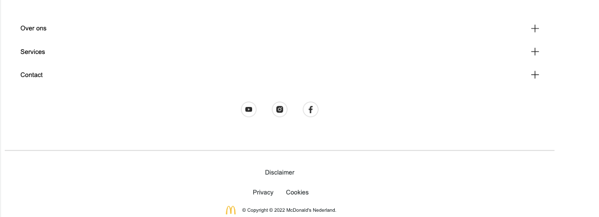

  ### Agenda voor meeting
  samen met je groepje opstellen

  | student 1      | student 2          | student 3    | student 4        |
  | ---            | ---                | ---          | ---              |
  | dit bespreken  | en dit             | en ik dit    | en dan ik dat    |
  | en dat ook nog | dit als er tijd is | nog een punt | dit wil ik zeker |
  | ...            | ...                | ...          | ...              |

  ### Verslag van meeting
  hier na afloop snel de uitkomsten van de meeting vastleggen

  - punt 1
  - punt 2
  - nog een punt
  - ...

  niet toegepast

## Eindgesprek (week 5)

  
uitwerken voor eindgesprek

  ### Je uitkomst - karakteristiek screenshots:
  

  ### Dit ging goed/Heb ik geleerd: 
Het gebruiken van grid om een responsive design te maken, en dit ga ik zeker toepassen in de toekomst.
  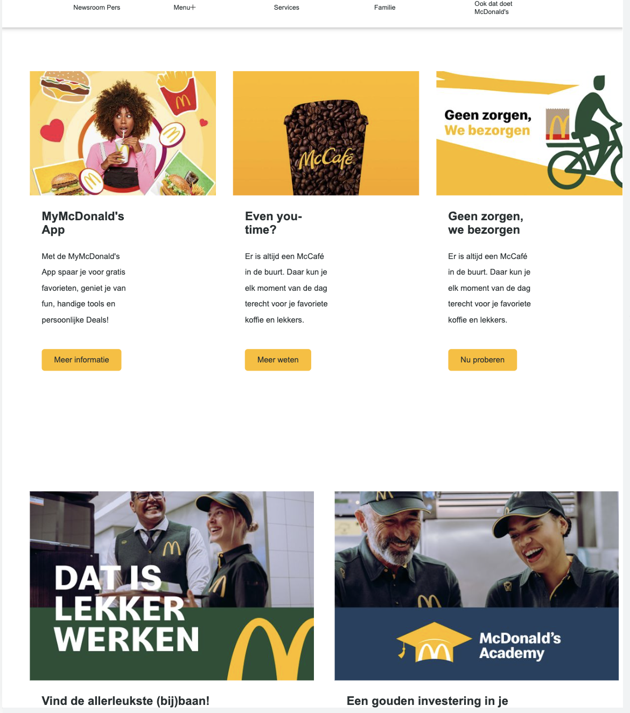

ook heb ik geleerd om een respponsive hamburger menu te maken. 
  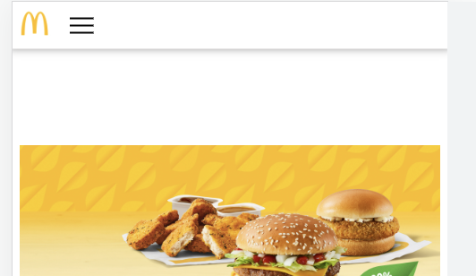

Ook heb ik veel gewerkt met @media query om het repsonsive te maken en dat vond ik erg fijn zodat ik nu echt weet wat ik doe 
  

  ### Dit was lastig/Is niet gelukt:
Het volledig mooi krijgen van mijn grid in de header
  

het volledig mooi krijgen van mijn grid in de main 
  

het mooi krijgen van de dropdownlist in de footer wanneer het groot scherm is.
  

## Bronnenlijst

  
continu bijhouden terwijl je werkt

  Nb. Wees specifiek ('css-tricks' als bron is bijv. niet specifiek genoeg). 
  Nb. ChatGpT en andere AI horen er ook bij.
  Nb. Vermeld de bronnen ook in je code.

  1. <a href= "https://www.youtube.com/watch?v=flItyHiDm7E"> link naar video die ik heb gebruikt als referentie </a>
  2. <a href= "https://css-tricks.com/css-only-carousel/" > link naar CSS triks voor slider</a>
  3. <a href= "https://www.sliderrevolution.com/resources/css-dropdown-menu/" > link naar website voor het maken van een dropdownlist</a>
  4. <a href="https://chat.openai.com/?model=text-davinci-002-render-sha"> Link naar ChatGPT, omdat ik wel eens wat heb gevraagd voor inspiratie</a>

